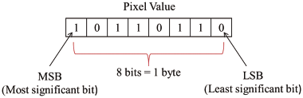
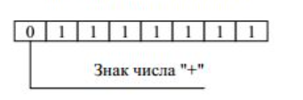

# Основы языка

## Типы данных 

В Java каждая переменная и выражение имеет свой некоторый тип данных.

### Пример:

    int a = 10; // Variable of type int
    int b = 15; // Variable of type int
    System.out.println(a + b); // Printing Some expression of type int

Каждый тип данных четко определен. 
Каждое присваивание должно проверяться компилятором на совместимость с данным типом, из-за вышеперечисленных причин можно сделать вывод,
что Java является строго типизированным языком программирования.

Java разработана с учётом принципов объектно-ориентированного программирования, таких как абстракция, инкапсуляция, наследование и полиморфизм. Но в Java присутствуют
элементы процедурного программирования. Например, существуют примитивные типы данных: byte, short, int, long, float, double и char. Исходя из этого, можно сказать, что Java
является гибридным языком программирования, который сочетает в себе как объектно-ориентированные, так и процедурные принципы.

## Примитивные типы данных

В языке программирования Java существуют 8 примитивных типов данных. Примитивные типы данных
делятся на 2 группы: числовые типы и нечисловые типы. 

### Числовые типы данных
    
    1. Целочисленные типы
        -- byte
        -- short
        -- int
        -- long

    2. Числа с плавающей точкой
        -- float
        -- double

### Нечисловые типы данных

    1. boolean
    2. char

За исключением boolean и char, остальные типы данных рассматриваются как "знаковые".
Потому что мы можем присвоить им как отрицательные, так и положительные значения.

### Тип данных - byte 
    
    Размер: 1 байт(8 бит)

Most Significant Bit - это самый значимый бит в двоичном представлении числа. 
В двоичной системе счисления каждое число представляется с помощью последовательности битов (нулей и единиц). MSB является первым (самым левым) битом в этой последовательности.

MSB используются для определения знака числа. Если MSB равен 0, число является положительным, а если равен
1, то число отрицательное. Остальные биты представляют числовое значение.

Ммаксимальное положительное число, которое мы можем записать в 1 байт памяти- 127.

`$2^6 + 2^5 + 2^4 + 2^3 + 2^2 + 2^1 + 2^0$`

Минимальное число - -128. В двоичном представлении числа со знаком в дополнительном коде, самое маленькое отрицательное число можно получить путем установки MSB в 1, а остальные биты равными 0. В случае типа byte, это выглядит следующим образом: 10000000.

### Пример

    int b = 10; // Корректно
    int c = 127; // Корректно
    int d = 128; // Некорректно. CE: Possible last of precision found: int. required: byte

